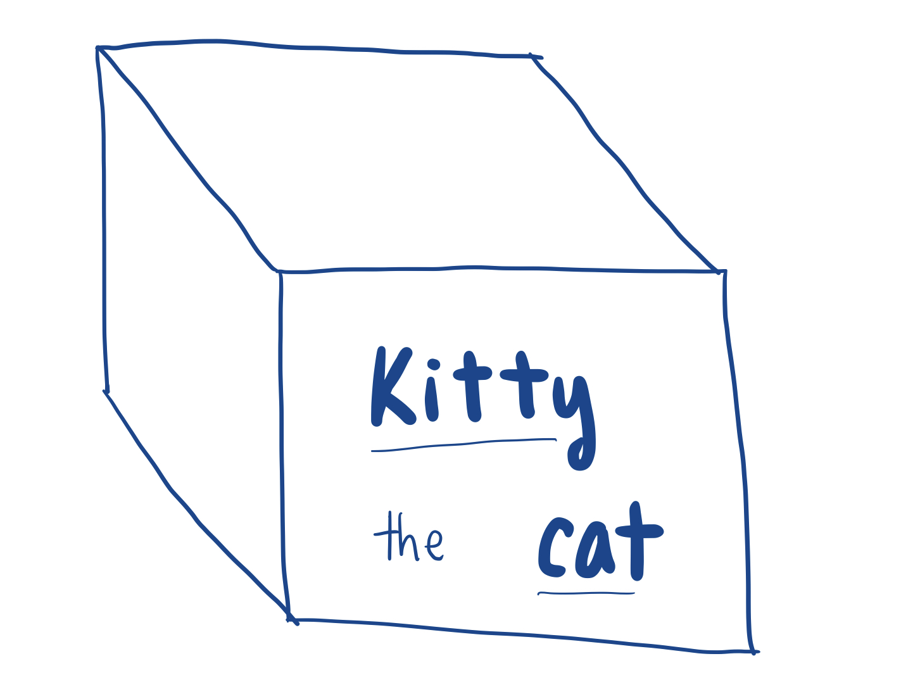

# Variables

Variables are the building blocks of any computer program and language. They are how a program stores and retrieves information. Computers can only do one thing at a time, so it is necessary to store information into variables so a computer can access it later on in time.

Think of variables as *boxes* that store information. Usually, variables must be *named* and *typed*. The name allows the computer to access that piece of information later, and the type tells the computer what kind of information is being stored. If a box is called **Kitty** and is of type **cat**, the computer knows to expect a cat when retrieving from the box **Kitty**. If it retrieves a dog, it will get confused (and usually crash).



## Primitive Variables

**Primitive variables** are variables that are built in to the language, you do not need to do anything to describe the type (later, there will be situations when you need to describe what a type is). Computer Science A only requires the knowledge of 3 types: `int`, `double`, and `boolean`. `int`s and `double`s are numbers and a `boolean` is a `true`/`false` value.

## Initializing, Assigning, and Accessing Variables

Like with boxes, a computer needs to know that a box exists first. With variables, this is called initializing a variable. A variable is initialized by giving it a type and a name, also called an identifier:

```java
int x;
double y;
```
Here, we initialized a variable called `x` and `y`, and they are of type `int` and `double`. Right now, these 'boxes' are not holding any information yet. If the program tries to access it right now, it will throw an error called `NullPointerException`.

To store information into a variable, simply set them equal to something. Here, the `=` sign is called the *assignment operator*, it assigns a value to a variable.

```java
x = 2;
y = 4.8;
```

A simple way to do the previous steps is to initialize and assign at the same time, like this:
```java
int x = 2;
double y = 4.8;
```

## Casting
Sometimes, it is necessary to express variables of one type as another. When they are compatible, this is called *casting*. For example, we can convert an integer into double by putting a new type in front of the variable:
```java
int a = 4;
double b = (double) a;
```
`b` now has value `4.0`, which is converted from `a`.

# Numbers

An `int` is an integer, and it stores whole numbers. A `double` is called a floating-point number, it stores a decimal number

Now that we know how to create and store our variables, we can do many things with them.

With numbers such as `int`s and `double`s, we can do things we would normally expect to be able to do with numbers, like adding, subtracting, multiplying, etc.

## Arithmetic Operators

Here are the arithmetic operators in Java:
 - `+` is the addition operator. It adds the numbers together.
 - `-` is subtraction, it subtracts numbers.
 - `*` is multiplication, it multiplies numbers.
 - `/` is division. For `int`s, it only returns the result rounded down to the nearest whole number. For example, `10 / 3` returns `3`.
 - `%` is modulo division. It returns the remainder when dividing 2 numbers. For example, `10 % 3` returns `1`.

All of these operations are done by placing a number to the left and right of the operator.
```java
a + b
a - b
a * b
a % b
```
<div class="callout callout--info">
    <p><strong>Mixing and Matching</strong></p>
    <p>It is not recommended that you mix and match variables within operations. However, it will not crash your program. When you have an int and a double together, the int is automatically casted to a double.</p>
</div>

We can do an operator and assign at the same time. For example, if you wanted to add 2 to `a` (and store it back to `a`), you could write `a = a + 2` or simply `a += 2`. This works with other operations as well. To increase or decrease an integer by 1, you can also do `a++` or `a--`.

 <div class="callout callout--info">
     <p><strong>Optional: Memory</strong></p>
     <p>A computer does not have infinite memory, and there are restrictions on how long an integer can be, or how precise a float will be. An int uses 32 bits. 1 bit is assigned to the sign (negative or positive), so ints have a min/max of \(\pm 2^{31} - 1\). Floats are stored as \((sign) \times (constant) \times 2^{exp}\). The constant and the power of 2 are each allocated a certain amount of memory. </p>
 </div>

# Booleans

Booleans are a `true` or `false` value in the computer. There are operations to combine booleans similar to numbers. They're initialized and assigned like so:
```java
boolean z = true;
```

 - `!` is the NOT operator. It flips a boolean. It is called by placing it in front of a boolean, like `!z` (which would return `false`).
 - `&&` is the AND operator. It returns `true` if both sides of the operator are `true`, otherwise, it returns `false`. i.e. `true && true` is true.
 - `||` is the OR operator (shift-forward slash on the keyboard). It returns `true` if any one of both sides are true. i.e. `true || false` is true.  

We can create truth tables to determine the results of these operators.

| AND | T | F |
|-----|---|---|
| T   | T | F |
| F   | F | F |

| OR | T | F |
|----|---|---|
| T  | T | T |
| F  | T | F |

# Summary
In this unit: 
 - Primitive variables.
 - Working with numbers.
 - Arithmetic operators.
