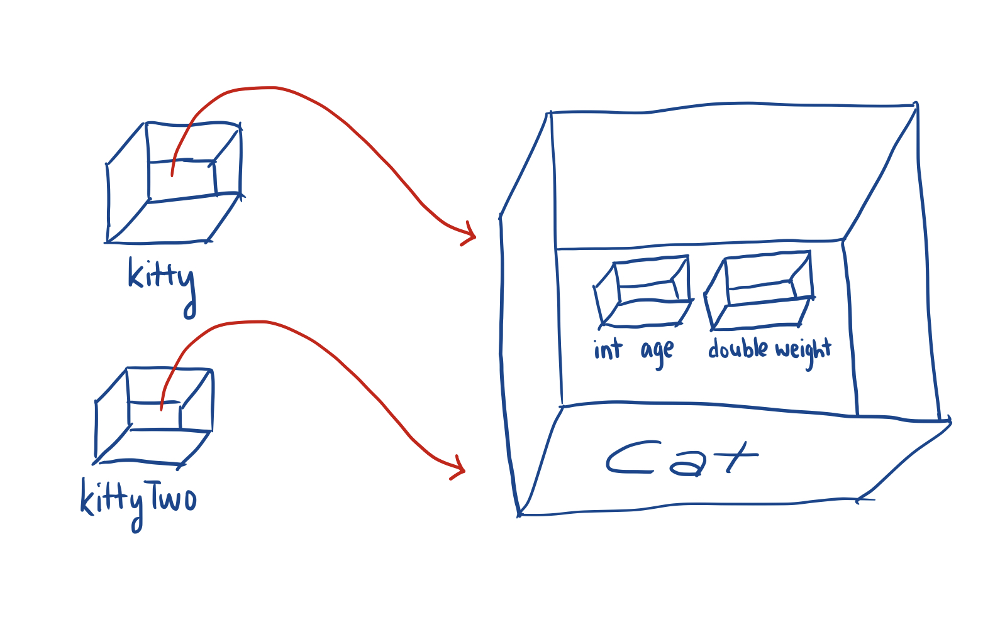

# Objects

The last unit was concerned with primitive types—those that were already within Java. However, there might be other types of information that you are trying to represent in a variable. These are called *objects*. Using the same analogy, instead of Java knowing specifically that the variable box is containing an `int` variable or `double` variable, it is a special type that is usually defined by the user (or sometimes, already in Java).

## Classes

Here is how a class might be defined
<div class="example"></div>
```java
public class Cat {
		private int age;
		private double weight;

		public Cat() {
				// Constructor
		}

		...

}
```
We have now told the program that there is a new type of variable, a `Cat` object. Objects can contain *class variables*, these are variables that belong to this object. If each `Cat` is similarly a box, you can imagine smaller boxes (representing the class variables) being placed within the larger box of the cat.

If we want to create a new object of a certain class, we can call
```java
Cat kitty = new Cat();
```
which stores a pointer to the Cat object into the variable `kitty`.

Note:
 - When creating and storing objects, what is really stored is a pointer. This means that `Cat kittyTwo = kitty`, will still assign the same `Cat` object to `kittyTwo`. Changing something with `kitty` will also change that with `kittyTwo`.

 


## Methods

Classes can also have *methods* which are functions that can take some input and generate some output (this is optional).

For example, within the `Cat` class, there might be a `eat()` function:
```java
public void happyBirthday() {
		age += 1;
}
```
The parentheses after the `eat` is where parameters would go, if `eat` were to take any input variables. This example, however, does not. The `public` before the `eat()` indicate that code outside of the `Cat` class can access this method. The `void`, which is a *return type*, tells us that this function does not return an output.

Calling `kitty.happyBirthday()` will increase the age of `kitty`.

### Parameters and Returns

Consider another method:
```java
public double eat(double amount) {
		weight += amount;
		return weight;
}
```
Now, `eat` takes a variable `amount`, which is a `double`. Calling `kitty.eat(1.8)` will add 1.8 to `weight` of `kitty`. These are called *parameters* of a method, and they are added in the format `(type) (name)`. Multiple can be separated by a comma.

`eat` will do another thing, it will *return* the weight of the cat. This is done through the `return weight;` line of the code. Note that once something is returned, the method will stop running. We can use this return as we would any number: `double newWeight = kitty.eat(1.8) + 2`, for example.

### Getters and Setters

There are *accessor* and *mutator* methods (also called *getters* and *setters*) which retrieve and change class variables (since they are denoted `private`, no class outside can access these). For `Cat`, this is how they might look like.
<div class="example"></div>
```java
public int getAge() {
		return age;
}

public void setAge(int newAge) {
		age = newAge;
}
```

# Strings

`String`s are another common type of common objects in Java. They are built-in, and do not need to be written. As they are a class, the 'S' in String is capitalized (as opposed to `int` and `double`).

Here's an example String:
```java
String greeting = "Hello World!"
```

We can do many things with Strings, like compare them (alphabetically), get characters, get substrings (a String that is a part of the original string).

Here are all the string methods:
 - `int length()` which returns the length of the string, including spaces and all characters. `length(greeting)` returns 12.
 - `String substring(int from, int to)` returns a substring beginning at index `from` and ending at the character before index `to`. (see arrays [note to self to link] for an explanation of indices).
 - `String substring(int from)` returns the substring from `from` to the end.
 - `int indexOf(String str)` tries to find a substring `str` within the string. This returns the first occurrence of `str`, otherwise it returns `-1`.
 - `boolean equals(String other)` returns whether a string is equal another string.
	 - Do not use `==` on strings as they are objects, not primitive variables. Two strings with the exact same text might be different objects.
 - `int compareTo(String other)` compares the two strings. All you need to know is that it returns a value less than 0 if a string is less than `other` and more than 0 if a string is more than `other`.
	 - Technically, they are converted to unicode values and the values are compared.
	 - This provides an alphabetical ordering of strings.

 <div class="callout callout--info">
     <p><strong>AP Appendix Sheet</strong></p>
     <p>The AP provides an appendix for the exams, that describes the methods you can call from Math and String classes. This is so you don't need to remember the specific methods! </p>
		 
 </div>


# Math

There is a class that performs math functions. It is the `Math` class. This class only has what's called *static methods*, so instead of calling methods from an object of a class (recall we created a `Cat` named `kitty`), we can call them from the class itself.

Here are the methods in `Math`:
 - `Math.abs(int/double x)` returns the absolute value of `x` (this works for both integers and doubles).
 - `Math.pow(double base, double exponent)` returns `base` raised to the power of `exponent` as a double.
 - `Math.sqrt(double x)` returns the square root of `x` as a double.
 - `Math.random()` returns a double greater than or equal to 0.0 and less than 1.0.
	 - We can generate integers in a certain range by taking doing `(int) Math.random() * n` which gives a nonnegative number less than `n`.

# Summary
In this unit:
 - The concept of a *class* and *object*.
 - Class variables and methods.
	 - Getter and setter methods.
 - The `String` class.
 - The `Math` class.
